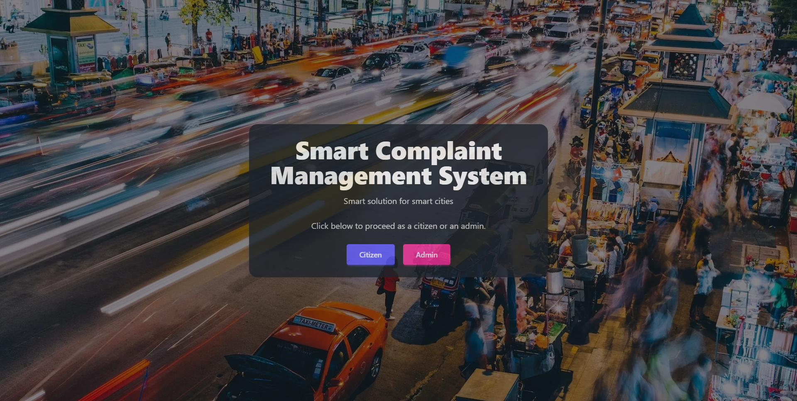

# 🚀 Smart Complaint Management System

A full-stack web application that enables **citizens** to register complaints and **administrators** to manage them. Includes user authentication, image/location-based complaint registration, and an admin dashboard for tracking status.

 <!-- Replace with your hosted image link -->

---

## 📌 Features

### 👥 Citizen
- Sign up / Login / Logout / Password reset
- Register complaints with image & location
- Upvote complaints posted by others

### 🛠️ Admin
- Secure login with password reset
- View and manage all complaints
- Update complaint status (Pending ➝ In Progress ➝ Resolved)

---

## 🧱 Tech Stack

### 🖥️ Frontend
- Vite + React
- Tailwind CSS + DaisyUI
- React Router, Axios, Toast Notifications
- GeoLocation (for maps)

### 🌐 Backend
- Node.js + Express.js
- MongoDB + Mongoose
- Cloudinary (image upload)
- JWT Auth
- Nodemailer (email reset)

---

## 📂 Folder Structure

```
Smart-Complaint-Management-System/
│
├── client/    # React client
├── server/     # Express server
├── .gitignore
└── README.md
```

---

## ⚙️ Getting Started

### 🧩 Prerequisites

Before running the project, ensure:

- Node.js and npm installed
- MongoDB is running locally or on a cloud service
- Cloudinary account
- Gmail App Password enabled for Nodemailer

---

### 📦 Installation

```bash
# Clone the repository
git clone https://github.com/your-username/smart-complaint-management-system.git
cd smart-complaint-management-system

# Frontend setup
cd client
npm install

# Backend setup
cd ../server
npm install
```

---

### 🚀 Running the App

```bash
# Run backend
cd client
npm run dev

# Run frontend (in new terminal)
cd server
npm run dev
```

The app will be available at:  
➡️ Frontend: `http://localhost:5173`  
➡️ Backend: `http://localhost:5000`

---

## 🔐 Environment Setup

Before running, create `.env` files in both `client/` and `server/` folders:

### ✅ Create `server/.env`

```env
PORT=5000
MONGODB_URI=your_mongodb_uri
CLOUDINARY_CLOUD_NAME=your_cloud_name
CLOUDINARY_API_KEY=your_api_key
CLOUDINARY_API_SECRET=your_api_secret
JWT_SECRET=your_jwt_secret
EMAIL_USER=your_email@gmail.com
EMAIL_PASS=your_app_password
```

> ⚠️ **Note**: Do not commit real secrets. Create a `.env.example` with the variable names for others to configure.

---

## 📜 NPM Scripts

### client (`client/package.json`)

```json
"scripts": {
  "dev": "vite",
  "build": "vite build",
  "preview": "vite preview",
  "lint": "eslint ."
}
```

### server (`server/package.json`)

```json
"scripts": {
  "dev": "nodemon index.js"
}
```

---

## 📁 .gitignore

Recommended `.gitignore` for this project:

```
# Logs
logs
*.log
npm-debug.log*
yarn-debug.log*
pnpm-debug.log*

# Dependencies
node_modules/
client/node_modules/
server/node_modules/

# Build
dist/
build/
client/dist/
server/dist/

# Env Files
*.env
.env.*.local

# Vite
.vite/

# Editor/OS
.vscode/*
!.vscode/extensions.json
.idea/
.DS_Store
*.suo
*.ntvs*
*.njsproj
*.sln
*.sw?
Thumbs.db
```

---

## 🌍 Deployment

> Deployment guides for **Render**, **Vercel**, or **Railway** coming soon. Make sure to set all environment variables correctly on the deployment platform.

---

## 🤝 Contribution

Contributions are welcome!  
Feel free to fork, improve and send a PR. For major changes, please open an issue first.

---

## 📄 License

This project is licensed under the [MIT License](LICENSE).
